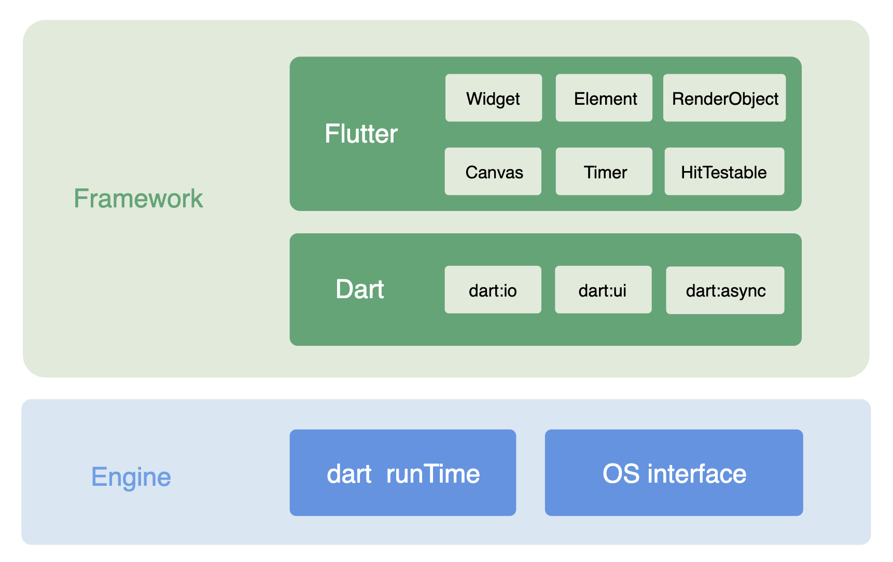
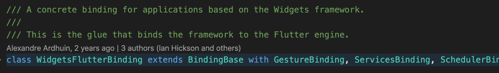

# Flutter

### 关于Flutter

Flutter是一个由谷歌开发的开源UI框架，用于为Android、iOS、 Windows、Mac、Linux、Fuchsia开发应用.


Flutter采用自绘引擎的方式进行UI渲染,也就是底层会调用Skia、OpenGL这种跨平台的绘制引擎直接为GPU提供绘制数据,所以其性能会大于等于原生组件的性能.

采用自绘引擎的方式会带来两个好处:一个是平台无关性;一个是操作系统版本的无关性.

平台无关性是说在Android、ios、Windows、Mac、Linux、Fushia等操作系统中UI会有良好的一致性体验.这个很好理解,因为各个平台的显示原理与OpenGL引擎的表现是一致的.

操作系统版本无关性就是说操作系统的不同版本对UI的绘制(系统提供的功能除外)几乎没有影响,因为Flutter的UI绘制并不是使用与操作系统版本具有强相关的组件进行绘制的,也就不会有因为操作系统升级而导致的组件渲染差异所带来的一些奇奇怪怪的bug困扰.

### Flutter架构

可以把整个Flutter架构分为上下两部分,上层为Framework,下层为Engine.	如下图:



上层Framework是由Dart语言和用Dart编写的Flutter框架组成;下层Engine是用C++实现的引擎,是连接上层Framework和底层操作系统的桥梁,主要包含Dart运行时和操作系统环境为运行时提供的接口(Skia渲染引擎和文字排版引擎).

在Flutter架构中,有一个在Framework和Engine引擎之间起到连接作用的关键类:即Window类.

Window类是定义在Dart:ui中的,其官方解释是:The most basic interface to the host operating system's user interface.也就是宿主操作系统提供的最基本的接口.

Window类提供了屏幕尺寸、事件回调、图形绘制接口以及其他一些核心服务.

这种架构完全可以类比一下React架构,如下图


React架构也可以分为上下两部分,上层为Framework,下层为Engine.

上层Framework是由Javascript语言和用Javascript编写的React框架组成;下层Engine是用C++实现的引擎,也是连接上层Framework和底层操作系统的桥梁,主要包含JS运行时和操作系统为运行时提供的接口(也就是宿主环境,比如浏览器,浏览器里封装了对操作系统Network、GPU等的调用).

在React架构中,也有一个在Framework和Engine引擎之间起到连接作用的关键对象:window对象.

window对象是宿主环境为javascript语言提供的,其官方解释是:The window object is supported by all browsers. It represents the browser's window.All global JavaScript objects, functions, and variables automatically become members of the window object. Global variables are properties of the window object.Global functions are methods of the window object.Even the document object (of the HTML DOM) is a property of the window object.也就是宿主浏览器提供的功能接口.

window对象提供了窗口尺寸、事件注册、网络请求等一些服务.

在浏览器中,基于window对象,可以用javascript编写出React、Vue、Angular等不同的UI框架.

同样的,在移动端中,基于Windows类,也可以用Dart编写出其他的UI框架来代替Flutter,只要你愿意.

### Flutter的渲染机制

因为Flutter采用的自绘引擎,所以它的渲染机制是和底层的显像原理相关的


在计算机系统中,显示器显示的图像帧来自于GPU缓存,GPU缓存中的图像帧是GPU计算的结果,GPU计算需要的数据是CPU通过总线传递过来的.

显示器每显示完一帧图像就会发送一个垂直信号(Vsync)给视频控制器,视频控制器就会从GPU缓存中读取下一帧图像并传递给显示器显示,如果一个显示器是60Hz的刷新频率,也就是说这个显示器每秒会发送60次这样的垂直信号(Vsync).同样,如果GPU在一秒内可以吐出90帧的图像,那么显示输出就是90fps.

而Flutter渲染所关注的就是在下一次垂直信号到来之前(两次Vsync之间)尽可能快的计算出下一帧图像数据并交给GPU.

换句话说,Flutter的渲染动作完全是依靠垂直信号(Vsync)来驱动的(除了第一次),记住这一点很重要,因为不论是通过setState更新UI还是UI动画的渲染,都是依靠不断请求Vsync来驱动进行的.


如上图,Flutter请求来的垂直同步信号(Vsync)被GPU传递到UI线程里,UI线程里的Dart运行时接受到Vsync后会进行一个被称为渲染流水线(Rendering Pipeline)的处理过程来生成一种叫场景的图像数据(An opaque object representing a composited scene),场景再被送到GPU线程里(期间可能会多次经过硬件加速处理的过程)供Skia引擎处理成GPU可使用的数据,这些数据最后经由OpenGL送给GPU进行渲染成帧,并最终由视频控制器交给显示器显示.

### 渲染流水线

当把请求过来的Vsync传递到UI线程里时会触发一个渲染流水线(Rendering Pipeline) 如下图


渲染流水线会按顺序进行一系列阶段并最终产生一个Scene并发送给GPU:

- Animate(动画阶段):这个阶段要运行一些和动画相关的瞬时回调(transient frame callbacks),因为这里要和普通的重绘区别对待,动画里会涉及是否要再发起新的一帧以及何时发起的计算,这也是第一步需要确定的.
- Microtasks(微任务阶段):动画阶段会产生一些微任务,这个阶段执行那些微任务.
- Layout(布局阶段):这个阶段会重新计算所有被标记为dirty的RenderObject的尺寸和大小.
- CompositingBits(合成标记阶段):对RenderObject进行标记,是否需要在下次的渲染流水线中重绘
- Paint(绘制阶段):使用PaintingContext对所有脏RendeObject进行重新绘制,这个阶段会产生Layer Tree
- Compositing(合成阶段):这个阶段会把Layer Tree转换成场景并发送到GPU
- Semantics(语义阶段):更新发送语义
- Finalization(完结阶段):主要进行一些收尾工作,比如卸载所有不处于active状态的element

当Flutter需要更新UI的时候,会请求一次Vsync信号来触发一次重新渲染.

Vsync信号到达engine层时,engine会调用 window.onBeginFrame回调,此时Rendering Pipeline开始进行Animate和Microtasks阶段.

在Animate和Microtasks阶段完成后,engine会接着调用window.onDrawFrame回调,该回调会进行Rendering Pipeline剩下的阶段.


以上就是一个完整的渲染流水线,由此可见Rendering Pipeline的8个阶段是在onBeginFrame和onDrawFrame这两个回调中触发的.

再次强调Flutter的渲染动作完全是依靠垂直信号(Vsync)来驱动的,不论是通过setState更新UI还是UI动画的渲染,都是依靠不断请求Vsync来驱动进行的.但除了第一次,即入口函数里的runApp,因为第一次渲染不会请求Vsync而是直接进入流水线渲染.

下面通过runApp入口函数来具体看一下渲染流水线的各个阶段.

### runApp函数

runApp函数的官方解释是Inflate the given widget and attach it to the screen.The widget is given constraints during layout that force it to fill the entire screen.

也就是说调用runApp的结果就是展开一个widget并挂载到屏幕上,并且会给这个被挂载的widget一个铺满整个屏幕的约束.

runApp函数在程序中可以被调用多次.当再次被调用时,原来挂载到屏幕上的根widget会被卸载掉,并替换上新传入的根widget,这两个widget之间仍然会进行diff算法比较只进行边际增量的更新.

这是Flutter规定的内置入口,除非自己实现一个Xlutter框架可以不走这个入口.

但以上只是runApp运行的结果,并没有体现出渲染流水线的具体过程来

所以需要点开runApp源码查看具体做了哪些事情


```dart
void runApp(Widget app) {
  WidgetsFlutterBinding.ensureInitialized()
    ..scheduleAttachRootWidget(app)
    ..scheduleWarmUpFrame();
}
```

runApp方法里很简洁,总结起来一共做了三件事情:

- 初始化了WidgetsFlutterBinding类的实例
- 调用了实例的scheduleAttachRootWidget方法
- 调用了实例的scheduleWarmUpFrame方法

接着再查看WidgetsFlutterBinding类的初始化过程

```dart
class WidgetsFlutterBinding extends BindingBase with GestureBinding, ServicesBinding, SchedulerBinding, PaintingBinding, SemanticsBinding, RendererBinding, WidgetsBinding {
  static WidgetsBinding ensureInitialized() {
    if (WidgetsBinding.instance == null)
      WidgetsFlutterBinding();
    return WidgetsBinding.instance;
  }
}
```

发现ensureInitialized并不是一个命名构造函数,而是一个静态方法,这个静态方法实现了WidgetsFlutterBinding的单例模式.

在静态方法ensureInitialized内部调用了WidgetsFlutterBinding的默认构造函数,并返回WidgetsFlutterBinding实例.

这里有很多值得研究的地方,当调用WidgetsFlutterBinding()的时候,其实是进行了很多的绑定动作的.

首先观察到WidgetsFlutterBinding继承了BindingBase类,并且mixin了7种binding.BindingBase类的默认构造函数会调用initInstances方法,而这7种binding也都重写了initInstances方法,也就是说在调用WidgetsFlutterBinding()构造函数初始化的时候,这7个binding所重写的initInstances也都会执行并且只一遍来执行相应的初始化绑定操作.

其次还要注意到这7种mixin混入的顺序,先混入的binging要比后混入的binding更基础,因为后混入的binding会使用或重写先混入的binding中的方法,由此可以看出widgetsBinding是更higher-level的库,所以说WidgetsFlutterBinding的注释中会有这么一句话



即应用程序基于Widgets framework的具体绑定.也可以大体可以猜到这个类为什么叫WidgetsFlutterBinding而不叫RenderingFlutterBinding或其他的名字,因为WidgetsBinding之前的初始化都是直接和渲染层(render layer)打交道的,在渲染层之上你也可以实现其他的更高级的库,比如叫个Xidgets、Yidgets啥的.事实上Flutter也确实提供了只到RendererBinding绑定的类以供使用.
```dart
class RenderingFlutterBinding extends BindingBase with GestureBinding, ServicesBinding, SchedulerBinding, SemanticsBinding, PaintingBinding, RendererBinding {
  RenderingFlutterBinding({ RenderBox root }) {
    assert(renderView != null);
    renderView.child = root;
  }
}
```
####  Binding Mixins

通过这7种mixin的名字也可以知道它们的主要作用就是在初始化的过程中进行一些绑定操作,这些绑定主要就是通过绑定window实例上的某些回调来和Engin层进行通信,前面讲过window是Framework层和Engine层的粘合剂.

要绑定window上的回调就要先引用这个window对象,所以在BindingBase中可以看到以下这段代码

```dart
import 'dart:ui' as ui show saveCompilationTrace, Window, window;
...
abstract class BindingBase {
...
ui.Window get window => ui.window;
...
}
```

这段代码在BindingBase中设置了一个window getter,引用了dart:ui中的window实例,这个window getter可以在所有的binding中被使用.

接下来

- GestureBinding

  这个binding看名字就可以知道,主要就是进行一些手势相关的绑定.绑定了window对象上的 onPointerDataPacket 回调
  ```dart
    window.onPointerDataPacket = _handlePointerDataPacket;
  ```
  
- ServicesBinding

  这个binding主要是对平台消息进行监听并对消息进行转发
  ```dart
     window.onPlatformMessage = defaultBinaryMessenger.handlePlatformMessage;
  ```
  
- SchedulerBinding

  这个binding很重要,渲染流水线中的window.onBeginFrame回调和window.onDrawFrame回调,还有发起一帧的请求都是在这里注册的
  ```dart
  //注册onBeginFrame和onDrawFrame回调
    @protected
    void ensureFrameCallbacksRegistered() {
      window.onBeginFrame ??= _handleBeginFrame;
      window.onDrawFrame ??= _handleDrawFrame;
    }
  ```
  ```dart
  //请求一帧
    void scheduleFrame() {
      if (_hasScheduledFrame || !framesEnabled)
        return;
      ensureFrameCallbacksRegistered();
      window.scheduleFrame();
      _hasScheduledFrame = true;
    }
  ```

  同时它还为渲染流水线提供流程管理的功能,为了协调“发起一帧”这个动作与Rendering Pipeline中8个阶段的执行顺序(因为一次Rendering Pipeline可能没有执行完,app就又发起了一次帧请求),SchedulerBinding内部定义了5种不同的Schedule状态

  - idle
    - 空闲状态
  - transientCallbacks
    - 瞬时回调被执行状态,执行Animate阶段的函数都被注册进transientCallbacks里面
  - midFrameMicrotasks
    - 瞬时回调返回的微任务被执行状态
  - persistentCallbacks
    - 持久回调被执行状态.执行Layout、Compositing bits、Paint、Compositing、Semantics、Finalization这些阶段的函数都被注册进了persistentCallbacks里面
  - postFrameCallbacks
    - 收尾回调被执行,这里的函数主要进行一些clean动作并为下一次帧请求做好准备
  
  当onBeginFrame的回调被调用后渲染流水线进入的Animate阶段和Microtasks阶段对应的就是transientCallbacks状态和midFrameMicrotasks状态,而persistentCallbacks状态对应的就是onDrawFrame的回调被调用后渲染流水线进入的剩下6个阶段.
  
  在ensureVisualUpdate函数(这个函数是在UI需要重绘时触发的)中可以看出只有当Schedule阶段处于idle和postFrameCallbacks状态(也就是)时才会发起新的一帧请求
  ```dart
  void ensureVisualUpdate() {
    switch (schedulerPhase) {
      case SchedulerPhase.idle:
      case SchedulerPhase.postFrameCallbacks:
        scheduleFrame();
        return;
      case SchedulerPhase.transientCallbacks:
      case SchedulerPhase.midFrameMicrotasks:
      case SchedulerPhase.persistentCallbacks:
      return;
    }
  }
  ```
  
- PaintingBinding

  绑定绘制库,做一些和图片缓存相关的工作

- SemanticsBinding

  语义层的绑定,平台可能启动的其他辅助功能

  ```dart
  _accessibilityFeatures = window.accessibilityFeatures;
  ```

- RendererBinding

  这个binding也相当重要,主要做了一些和渲染有关的事情.

  在Flutter应用中凡是屏幕中能看到视觉渲染效果都是用render tree渲染出来的, render tree会被加工成layer tree,而layer tree又会被转化成一个scene输送给GPU.

  render tree是由多个render object组成的一棵树结构,而正是在这个binding里create了这棵树的根节点renderView.

  这个根节点renderView里面有个叫compositeFrame的方法,这个方法就是在渲染流水线的Compositing阶段把layer tree转化成scene并输送给GPU的方法.

  其中的buildScene和render分别对应了转化和输送阶段.

  ```dart
  void compositeFrame() {
    Timeline.startSync('Compositing', arguments: timelineWhitelistArguments);
    try {
      final ui.SceneBuilder builder = ui.SceneBuilder();
      final ui.Scene scene = layer.buildScene(builder);
      if (automaticSystemUiAdjustment)
        _updateSystemChrome();
      _window.render(scene);
      scene.dispose();
    } finally {
      Timeline.finishSync();
    }
  }
  ```

  这个binding还初始化了一个PipelineOwner实例来管理render tree上的所有节点.

  这个PipelineOwner实例只会被初始化一次,并会被所有render object所共同持有,每个render object都会有一个owner字段引用该实例.

  PipelineOwner主要维护了三个list

  - _nodesNeedingLayout
    - 需要重新layout的脏render object
  - _nodesNeedingPaint
    - 需要重新paint的脏render object
  - _nodesNeedingCompositingBitsUpdate
    - 被标记的render object以供判断

  当脏render objects需要重新layout或paint的时候,会调用PipelineOwner实例的onNeedVisualUpdate回调,这个回调会间接触发ensureVisualUpdate方法来请求一帧并触发一次rendering pipeline.

  而一次rendering pipeline周期中onDrawFrame回调所调用的persistentCallbacks也是在这个binding里注册的
  ```dart
  //注册persistentCallbacks
  addPersistentFrameCallback(_handlePersistentFrameCallback);
  ...
  ...
  ...
  //定义的persistentCallbacks回调
  void _handlePersistentFrameCallback(Duration timeStamp) {
    drawFrame();
    _mouseTracker.schedulePostFrameCheck();
  }
  @protected
  void drawFrame() {
    assert(renderView != null);
    pipelineOwner.flushLayout();
    pipelineOwner.flushCompositingBits();
    pipelineOwner.flushPaint();
    if (sendFramesToEngine) {
      renderView.compositeFrame(); // this sends the bits to the GPU
      pipelineOwner.flushSemantics(); // this also sends the semantics to the OS.
      _firstFrameSent = true;
    }
  }
  ```

  这里面的pipelineOwner.flushLayout()、pipelineOwner.flushCompositingBits()、pipelineOwner.flushPaint()、renderView.compositeFrame()、pipelineOwner.flushSemantics()分别对应了render pipeline中的Layout、CompositingBits、Paint、Compositing、Semantics阶段

  其中pipelineOwner.flushLayout()、pipelineOwner.flushCompositingBits()、pipelineOwner.flushPaint()这三个方法会循环遍历\_nodesNeedingLayout、\_nodesNeedingPaint、\_nodesNeedingCompositingBitsUpdate这三个list对元素进行操作(performLayout、PaintingContext.repaintCompositedChild、_updateCompositingBits方法).

  ```dart
    void flushLayout() {
      ...
      while (_nodesNeedingLayout.isNotEmpty) {
        final List<RenderObject> dirtyNodes = _nodesNeedingLayout;
        _nodesNeedingLayout = <RenderObject>[];
        for (final RenderObject node in dirtyNodes..sort((RenderObject a, RenderObject b) => a.depth - b.depth)) {
          if (node._needsLayout && node.owner == this)
            node._layoutWithoutResize();
        }
      }
    }
  
    void flushCompositingBits() {
      ...
      for (final RenderObject node in _nodesNeedingCompositingBitsUpdate) {
        if (node._needsCompositingBitsUpdate && node.owner == this)
          node._updateCompositingBits();
      }
    }
    void flushPaint() {
      final List<RenderObject> dirtyNodes = _nodesNeedingPaint;
      _nodesNeedingPaint = <RenderObject>[];
      // Sort the dirty nodes in reverse order (deepest first).
      for (final RenderObject node in dirtyNodes..sort((RenderObject a, RenderObject b) => b.depth - a.depth)) {
        if (node._needsPaint && node.owner == this) {
          if (node._layer.attached) {
            PaintingContext.repaintCompositedChild(node);
          } else {
            node._skippedPaintingOnLayer();
          }
        }
      }
  }
  ```
  到这里Flutter的渲染流水线需要的绑定和回调已经都注册完成,一个完整的流水线可以运行起来了.

  

  可以发现Rendering Pipeline就是对Render Tree进行加工操作并最终返回一个Scene的过程,完全看不到Widget和Element的影子,这也再次印证了RenderFlutterBinding是直接和渲染层打交道的,可以在这之上编写一个更higher-level的库来实现一个UI框架.

  如果说Flutter是一个响应式的UI框架,Render Tree代表UI,那么Widget和Element就代表了响应式,就好比React中VirtualDOM和Dom之间的关系.

- WidgetsBinding

  这层的binding相比前面的binding是在更高一层上做了初始化操作,前面的binding主要涉及render layer,而这层binding主要涉及widgets layer.也可以这么说,这层binding做了对render tree的代理(即widget)所封装的响应式逻辑的初始化.

  WidgetsBinding在初始化的时候基本上就做了两件事情:

  - 实例化了一个所有Element都持有并共享的BuildOwner,每个Element实例都通过owner字段引用该实例.这点和PipelineOwner差不多.一棵Element树只能有一个BuildOwner,但也可以多建几个BuildOwner来管理离屏的Element树
    -  ```dart
        _buildOwner = BuildOwner();
       ```
    
  - 绑定了window上的两个回调
    - ```dart
        window.onLocaleChanged = handleLocaleChanged;
        window.onAccessibilityFeaturesChanged = handleAccessibilityFeaturesChanged;
      ```
  
   BuildOwner主要作用就是跟踪维护改动的widgets和elements.
  
   - 它内部维护了两个list:
      - _InactiveElements
        - 严格来说这是一个内部定义了一个list的类
        - 存储处于inactive状态的element
      - _dirtyElements
        - 存储需要重新被构建的element
    
   - 还定义了两个重要方法
      - scheduleBuildFor
        - 由element实例调用,把自己添加进_dirtyElements
        ```dart
          void scheduleBuildFor(Element element) {
            if (!_scheduledFlushDirtyElements && onBuildScheduled != null) {
              _scheduledFlushDirtyElements = true;
              onBuildScheduled();
            }
            _dirtyElements.add(element);
            element._inDirtyList = true;
          }
        ```
        在StateFulWidget中调用setState刷新UI的时候其实调用的就是这个方法,setState把一个element插入到_dirtyElements中,并发出一帧的请求来重新build在\_dirtyElements中的元素
        ```dart
        //setState方法
          void setState(VoidCallback fn) {
            ...
            _element.markNeedsBuild();
          }
        //markNeedsBuild方法
          void markNeedsBuild() {
            _dirty = true;
            owner.scheduleBuildFor(this);
          }
        ```
        
      - buildScope
        - 重构_dirtyElements中的element,会根据element的类型不同调用不同performBuild
        - 这个方法一般会在onDrawFrame的回调里调用,因为这个WidgetsBinding重写了RendererBinding里的drawFrame方法
        ```dart
            @override
            void drawFrame() {
              ...
              buildOwner.buildScope(renderViewElement);
              super.drawFrame();
              buildOwner.finalizeTree();
            }
        ```
        可以发现在PipelineOwner调用drawFrame之前会调用buildScope方法,在PipelineOwner调用drawFrame之后会调用finalizeTree方法,也就是说其实在渲染流水线的Layout阶段之前其实还有一个Build阶段,这个Build阶段主要就是用来更新widgets和render object的.
        
        所以当用widgets framework对渲染层进行包装形成响应式的时候一个更完整的渲染流水线应该是这样的
        
        

以上一个Flutter应用基于Widgets Framework的初始化工作就完成了,紧接着在runApp中做的第二件事情就是调用scheduleAttachRootWidget函数

```dart
    void scheduleAttachRootWidget(Widget rootWidget) {
      Timer.run(() {
        attachRootWidget(rootWidget);
      });
    }

    void attachRootWidget(Widget rootWidget) {
      _readyToProduceFrames = true;
      _renderViewElement = RenderObjectToWidgetAdapter<RenderBox>(
        container: renderView,
        debugShortDescription: '[root]',
        child: rootWidget,
      ).attachToRenderTree(buildOwner, renderViewElement as RenderObjectToWidgetElement<RenderBox>);
  }
```

这里的名字起的很有意思,attachRootWidget、attachToRenderTree和传递的参数名字:container、child.

按字面意思widget是子,render object是容器,所以要attatch widget.从这种命名上可以窥见Flutter作者对render object和widget的心理定位:widget只是用来配置render object的附属.

所以说如果没有响应式这一层Framework,Flutter中的树结构应该是很直观和很好理解的,就一棵render tree,这个render tree上的每个节点都有引擎如何渲染的描述信息,但是在加入了响应式这一层Framework后情况就变得有些复杂了.

有了Widgets Framework这一层后Flutter和我们直接打交道的就不再是渲染层而是widgets层.就好像用了React后,我们就很少和真实的DOM树打交道也很少会调用appendChild、createElement这样的接口,而是直接使用Componet这样的组件.Component就相当于Widget,是个配置对象,这个配置对象会被createElement转化成VirtualDOM,最后通过render函数渲染成真实的DOM,也就是说VirtualDOM是Component和DOM之间的桥梁.

同样的,在FLutter中,Element就是Widget和RenderObject之间的桥梁,Widget也会被一个名为createElement的函数转化成一个Element,最后通过buildScope把配置信息更新到RenderObject上.

在attachToRenderTree中,就是创建了一个类型为RenderObjectToWidgetElement的Element根结点,然后再调用buildScope函数把element上的widget信息更新到render tree中.

```dart
    RenderObjectToWidgetElement<T> attachToRenderTree(BuildOwner owner, [ RenderObjectToWidgetElement<T> element ]) {
    if (element == null) {
      owner.lockState(() {
        element = createElement();
        assert(element != null);
        element.assignOwner(owner);
      });
      owner.buildScope(element, () {
        element.mount(null, null);
      });
      SchedulerBinding.instance.ensureVisualUpdate();
    } else {
      element._newWidget = this;
      element.markNeedsBuild();
    }
    return element;
  }
```

render tree中的渲染信息已万事俱备,就差一个垂直同步信号来一场渲染流水线render出画面来,但是在runApp里已经迫不及待了,不等垂直信号而是调用了scheduleWarmUpFrame函数直接开启一个Rendering Pipeline渲染出首屏.
```dart
    void scheduleWarmUpFrame() {
      ...  
      Timer.run(() {
        handleBeginFrame(null);
      });
      Timer.run(() {
        handleDrawFrame();
      });
      ...
  }
```
### Element

在前面的描述中可以知道Widget和Element是属于响应式层面的概念,而RenderObject是属于渲染层面的概念.Widget是配置对象,RenderObject是被渲染引擎渲染的对象,Element是Widget和RenderObject之间的桥梁.

先说结论,在Flutter中一共存在两棵树,有几个Owner就有几棵树.有PipelineOwner和BuildOwner这两个Owner,就有RenderTree和ElementTree这两棵树,Widget只是这两棵树使用的配置对象.要理解这三个概念的关系需要从Element开始,因为Element是渲染逻辑的入口,Rendering Pipeline就是通过遍历dirty elements来完成的.

#### 定义

官方对Element的解释是An instantiation of a [Widget] at a particular location in the tree,按字面意思是说它是树上的某个widget的实例,这种描述其实并不准确,因为Element毕竟不是Widget类的实例,之所以这么说是因为Element是用Widget中定义的createElement创建的.一种类型的widget对应一个相应的element.

  ```dart
  abstract class Element implements BuildContext {
    Element _parent;
  
    Widget get widget => _widget;
    Widget _widget;
  
    BuildOwner get owner => _owner;
    BuildOwner _owner;
  
    RenderObject get renderObject 
  
    Element updateChild(Element child, Widget newWidget, dynamic newSlot)
  
    void mount(Element parent, dynamic newSlot)
  
    void markNeedsBuild()
  
    void rebuild()
  
    void unmount()
  }
  ```
  参考Element定义的源码可以注意到几个重要的属性和方法

  - _parent

    - 有_parent就说明了Element确实是一棵树,代表了父节点的引用

  - widget

    - 每个Element都会持有它的配置对象Widget

  - owner

    - 每个Element都会持有一个BuildOwner,这个是在WidgetBinding中初始化的

  - renderObject

    - 所有的Element都会有renderObject属性,但只有element的类型为RenderObjectElement时,其值才不会为null
    
  - updateChild
    
    - 根据新widget更新子element的方法,更新规则如下

    |                   | **newWidget == null**               | **newWidget != null**                                          |
    | :---------------: | :---------------------------------- | :-----------------------------------------------------------   |
    | **child == null** | Returns null.                       | Returns new [Element].                                         |
    | **child != null** | Old child is removed, returns null. | Old child updated if possible, returns child or new [Element]. |
    
    根据原来child的有无和传入新widget的有无,共分了四种情况,这个方法会在rebuild中被调用
    
  - mount

    - 新创建的element第一次被挂载到父节点的时候会被调用

  - markNeedsBuild

    - 标记element为脏数据,并把它放进BuildOwner维护的一个全局的脏列表_dirtyElements里,调用前面owner属性的scheduleBuildFor方法就可以完成

  - rebuild

    - 第一次加载和widget改变都会调用这个方法重新构建element.在一次RenderPipeline中由BuildOwner遍历脏列表时在buildScope方法中发起调用

  - unmount

    - 卸载element

通过以上属性和方法可以感知到Element好像是有一个生命周期的,事实上这个生命周期确实是存在的,但这个生命周期一般只会被Framework使用到
  ```dart
    enum _ElementLifecycle {
      initial, //初始化
      active,  //活跃态,在屏幕上可见
      inactive,//非活跃态,在屏幕上不可见
      defunct, //废止态,再也不见
    }
  ```

Element类是个抽象类,是不能直接被使用的,所以在Flutter中定义了两种继承自Element的抽象子类ComponentElement和RenderObjectElement.

#### ComponentElement
这种类型的Element是一个起到包装作用的父Element容器,主要通过封装一些逻辑来管理其子Element.

  ```dart
    abstract class ComponentElement extends Element {
      Element _child;
      Widget build();
    }
  ```
  通过源码可以发现,ComponentElement主要多了一个_child属性和一个build方法

  - _child

    这个属性表明在ComponentElement下面存在一个Element类型的子节点,这个子节点就是通过build返回的widget创建的.
    
    具体的创建过程定义在了inflateWidget中:
    
    ```dart
      Element inflateWidget(Widget newWidget, dynamic newSlot) {
        final Element newChild = newWidget.createElement();
        newChild.mount(this, newSlot);
        return newChild;
    }
    ```
    
    由此也可以得出一个结论,Element树其实是一棵组件树,也就是ComponentElement树.
    
  - build

    这个build返回一个新widget,这个需要被所有子类重写.

ComponentElement也是一个抽象类,同样不能被直接使用,所以又定义了三种继承自ComponentElement的子类StatelessElement、StatefulElement、ProxyElement.

##### StatelessElement

  ```dart
    class StatelessElement extends ComponentElement {
      @override
      Widget build() => widget.build(this);
    }
  ```

StatelessElement是以StatelessWidget为配置对象的Element,它会通过Widget.createElement()方法被创建.

这个Element主要重写了build方法,这个build方法调用了对应widget的build方法,在调用的时候会把element本身当作参数传进方法中,所以在widget的build方法中看到的BuildContext形参就是这个element实例.

build会在element实例中的performRebuild方法中被调用,StatelessElement拿到build返回的widget后会对子节点进行创建、更新等操作.

  ```dart
    void performRebuild() {
      Widget built;
      built = build();
      _child = updateChild(_child, built, slot);
    }  
  ```

##### StatefulElement

  ```dart
  class StatefulElement extends ComponentElement {
      
        StatefulElement(StatefulWidget widget): _state = widget.createState(),super(widget) {
              _state._element = this;
              _state._widget = widget;
        }
      
        @override
        Widget build() => _state.build(this);
      
        State<StatefulWidget> get state => _state;
        State<StatefulWidget> _state;
  
        void _firstBuild() {
          final dynamic debugCheckForReturnedFuture = _state.initState() as dynamic; 
          _state.didChangeDependencies();
          super._firstBuild();
        }
      
        @override
        void reassemble() {
          state.reassemble();
          super.reassemble();
        }
      
        @override
        void performRebuild() {
          if (_didChangeDependencies) {
            _state.didChangeDependencies();
            _didChangeDependencies = false;
          }
        super.performRebuild();
        }
  
        @override
        void update(StatefulWidget newWidget) {
          super.update(newWidget);
          final StatefulWidget oldWidget = _state._widget;
          _dirty = true;
          _state._widget = widget as StatefulWidget;
          try {
            _debugSetAllowIgnoredCallsToMarkNeedsBuild(true);
            final dynamic debugCheckForReturnedFuture = _state.didUpdateWidget(oldWidget) as dynamic;
          } finally {
            _debugSetAllowIgnoredCallsToMarkNeedsBuild(false);
          }
          rebuild();
        }
      
        @override
        void activate() {
          super.activate();
          markNeedsBuild();
        }
      
        @override
        void deactivate() {
          _state.deactivate();
          super.deactivate();
        }
      
        @override
        void unmount() {
          super.unmount();
          _state.dispose();
          _state._element = null;
          _state = null;
        }
      
        @override
        InheritedWidget inheritFromElement(Element ancestor, { Object aspect }) {
          return dependOnInheritedElement(ancestor, aspect: aspect);
        }
      
        @override
        InheritedWidget dependOnInheritedElement(Element ancestor, { Object aspect }) {
          return super.dependOnInheritedElement(ancestor as InheritedElement, aspect: aspect);
        }
      
        @override
        void didChangeDependencies() {
          super.didChangeDependencies();
          _didChangeDependencies = true;
        }
  }
  ```

StatefulElement是以StatefulWidget为配置对象的Element,它会通过Widget.createElement()方法被创建.

在源码中可以发现在StatefulElement内部重写了build方法,这个build方法调用的是\_state.build而不是widget.build,这也是为什么StatefulWidget的build要在State中重写而不在StatefulWidget中重写.

同时在element的内部还调用了widget.createState、\_state.initState()、\_state.reassemble()、\_state.didChangeDependencies()、\_state.didUpdateWidget(oldWidget)、\_state.deactivate()、_state.dispose()等方法,这些不正是state的几个生命周期嘛,在这里可以清楚的看到各个生命周期执行的时机.

  - widget.createState

    创建state实例的阶段,在调用widget.createElement对element进行初始化的时候会调用一次

  - \_state.initState()

    初始化state阶段,这个方法在\_firstBuild中被触发,也就是element还没开始挂载到树上.

  - \_state.didChangeDependencies()

    state的依赖完成改变阶段,这个方法会在\_firstBuild和performRebuild中触发:

    - 在_firstBuild中会紧随initState方法之后调用一次
    - 当重绘时在performRebuild方法中会有一次调用,会在didUpdateWidget调用之后发生

  - \_state.reassemble()

    这是个会在开发阶段触发的一个热重载阶段,又Flutter的底层foundation层通过BuildOwner触发,这个阶段会发生在重新build之前

  - \_state.didUpdateWidget(oldWidget)

    更新完widget后触发,这个函数会把old widget作为参数传进来.这个阶段的触发在_parent.build调用之后

  - \_state.deactivate()

    state的非活跃阶段,这个方法会在_parent.updateChild中触发,但触发条件要分两种情况:

    - 移除一个element,也就是新widget为null,旧widget不为null,会调用deactivate方法,后续的didUpdateWidget阶段不会存在.
    - 改变一个element,也就是新widget与就widget不是同一个类型的widget或者key值不一样,也会调用deactivate方法

  - _state.dispose()

    - state的释放阶段,处于非活跃状态的element在一次rendering pipeline结尾如果仍然没有被重新放回到树中,则在Finalization中会卸载有所有的element,在卸载之前会触发state的dispose方法.

  现在可以透过Element来总结一下State的生命周期

  

##### ProxyElement

ProxyElement以ProxyWidget为配置对象

```dart
abstract class ProxyElement extends ComponentElement {

  @override
  Widget build() => widget.child;

  @override
  void update(ProxyWidget newWidget) {
    final ProxyWidget oldWidget = widget;
    super.update(newWidget);
    updated(oldWidget);
    _dirty = true;
    rebuild();
  }

  void updated(covariant ProxyWidget oldWidget) {
    notifyClients(oldWidget);
  }

  @protected
  void notifyClients(covariant ProxyWidget oldWidget);
}
```

- build

  既然是个ComponentElement,重写build那就是必须的.但是这里重写的方式和前两个不一样,并不是调用widget的build方法,而是返回widget的child属性.也就是在编写ProxyWidget的时候不需要重写build函数而是为其child属性赋值就可以了,采用赋值的方式返回widget也就暗示了这个child属性最好不要改变.

- update

  ProxyElement还重写了update函数,这个是很值得玩味的.可以先看看重写之前的update函数做了些什么

  ```dart
    void update(covariant Widget newWidget) {
      _widget = newWidget;
    }
  ```

  可以看到原来的update就做了一件事情,用新的的widget给_widget属性赋值.而这里多做了两件事,额外调用了updated和rebuild方法.
  
  在前面分析中可以得知一个element在updateChild阶段会有四种情况,只有当新旧weidget的类型和key值相同的情况下才会走update这条线路.

  ```dart
    //in Element >> updateChild
    if (hasSameSuperclass && Widget.canUpdate(child.widget, newWidget)) {
        if (child.slot != newSlot)
          updateSlotForChild(child, newSlot);
        child.update(newWidget);
        newChild = child;
    }
  ```
  
  而这里重写update的方式也就暗示了在ProxyElement中执行updateChild时,一定要走update(widget.canUpdate为true)这条线路,否则就没什么意义了,和前两种ELement就没啥区别.要保证在updateChild时执行update就需要新旧widget的runtimeType和key值不变,也就是它的widget.child属性的类型和key不要改变.
  
  所以ProxyElement适合放在最顶层,它的widget.child最好放一些Scaffold这样不会被改变类型的脚手架.
  
- updated

  单独出这么一个函数来调用notifyClients是为了方便子类可以覆写它,可以加个判断用来决定是否要调用notifyClients.

- notifyClients

  这是一个需要子类覆写的方法,通过名字可以看出它是一个实现了类似于消息通知的方法.

  从这个方法可以看出ProxyElement存在的意义和为什么叫ProxyElement了,这个Element就是一个代理、一个不赚差价的中间商,它本身并不生产widget,它只是child属性搬运工.它的子widget并不是使用它的widget.build方法创造出来的,而是在被实例化的时候传入的child属性,所有的子节点都可以订阅或修改消息,它负责分发消息给对应的子节点.

因为ProxyElement是个抽象类,是不能被实例化的,所以会使用到它的两个子类:

- ParentDataElement

  和渲染对象有关,一般不会直接使用到,暂略.

- InheritedElement

  这个Element可以说是非常有用,可以用它来做全局的状态管理

  现在可以从mount开始分析一下订阅的消息机制是如何工作的

  ```dart
      void mount(Element parent, dynamic newSlot) {
          _updateInheritance();
      }
  ```
  
  可以看到在mount中调用了_updateInheritance方法,而这个_updateInheritance方法可以在子类InheritedElement中找到

  ```dart
    Map<Type, InheritedElement> _inheritedWidgets;
    void _updateInheritance() {
            final Map<Type, InheritedElement> incomingWidgets = _parent?._inheritedWidgets;
            if (incomingWidgets != null)
              _inheritedWidgets = HashMap<Type, InheritedElement>.from(incomingWidgets);
            else
              _inheritedWidgets = HashMap<Type, InheritedElement>();
            _inheritedWidgets[widget.runtimeType] = this;
    }
  ```

  这里做了一件事情就是为_inheritedWidgets这个Map变量赋值,如果在父节点中存在_inheritedWidgets则会合并到这里,如果父节点没有则为_inheritedWidgets赋初始值,键值为widget的runtimeType,value为这个element.

  经过mount一波猛如虎的操作这个InheritedElement就会被挂载到Element Tree中,此时并没有发生什么,接下来就是子节点要在这个代理中注册想要对消息.这个注册方法需要在InheritedElement的widget中手动定义,官方简易的注册写法是这样的

  ```dart
     static InheritedWidget_Name of(BuildContext context) {
        return context.dependOnInheritedWidgetOfExactType<InheritedWidget_Name>();
     }
  ```

  这个of方法要在子Widget的build中调用来获取InheritedWidget_Name实例,可以通过这个实例拿到存储在InheritedWidget_Name中的状态供子widget使用,但在这个获取实例的过程中会悄悄注册消息订阅事件.

  ```dart
      @override
      T dependOnInheritedWidgetOfExactType<T extends InheritedWidget>({Object aspect}) {
        final InheritedElement ancestor = _inheritedWidgets == null ? null : _inheritedWidgets[T];
        if (ancestor != null) {
          return dependOnInheritedElement(ancestor, aspect: aspect) as T;
        }
        _hadUnsatisfiedDependencies = true;
        return null;
      }
      Set<InheritedElement> _dependencies;
      @override
      InheritedWidget dependOnInheritedElement(InheritedElement ancestor, { Object aspect }) {
        _dependencies ??= HashSet<InheritedElement>();
        _dependencies.add(ancestor);
        ancestor.updateDependencies(this, aspect);
        return ancestor.widget;
      }
  ```

  在dependOnInheritedWidgetOfExactType中可以看到子节点拿到了它的代理ancestor并调用了dependOnInheritedElement,这个dependOnInheritedElement调用了代理element的updateDependencies方法并把子element作为参数传入,最后返回代理的widget(这里面存储着子widget需要的data).

  ```dart
  
    @protected
    void updateDependencies(Element dependent, Object aspect) {
      setDependencies(dependent, null);
    }

    final Map<Element, Object> _dependents = HashMap<Element, Object>();

    void setDependencies(Element dependent, Object value) {
      _dependents[dependent] = value;
    }

  ```

  又可以看到在updateDependencies中调用了setDependencies,这个setDependencies就是为代理中的_dependents赋值,_dependents的key值是子element实例.
  
  经过以上步骤就把子Element的实例注册在了InheritedElement中的_dependents属性的keys中.当触发渲染流水线重绘走到element的update函数时,就会调用前面说的在ProxyElement中定义的updated方法,这个方法会被InheritedElement重写

  ```dart
    @override
    void updated(InheritedWidget oldWidget) {
        if (widget.updateShouldNotify(oldWidget))
            super.updated(oldWidget);
    }
  ```

  重写的目的就是加了一层判断,需要开发者根据新旧widget自行判断是否要通知子节点触发didChangeDependencies事件,这个判断是在InheritedWidget中被重写的.如果返回true则会触发notifyClients通知注册的子element调用didChangeDependencies

  ```dart
     @override
     void notifyClients(InheritedWidget oldWidget) {
        for (final Element dependent in _dependents.keys) {
          notifyDependent(oldWidget, dependent);
        }
     }

    @protected
    void notifyDependent(covariant InheritedWidget oldWidget, Element dependent) {
        dependent.didChangeDependencies();
    }
  ```
  

以上就是ComponentElement的三种类型,ComponentElement存在的意义就是创建子节点,如果Flutter只使用ComponentElement那么在屏幕中是什么也不会看到的,会在内存中建立一个无穷尽的Element树,直到内存溢出或报错,因为每个ComponentElement一定会有build方法返回一个不能为空的子节点widget.所以这个ComponentElement树的每个分支一定要有个尽头,这个尽头就是RenderObjectElement.

#### RenderObjectElement

RenderObjectElement是比较复杂的,首先它也具有ComponentElement的功能也是可以产生树结构的,只是它的子节点不但可以是child还可以是children,而ComonentElement只有child.其次,RenderObjectElement是一个有布局、有样式、有画面的Element,因为每个RenderObjectElement都有一个属性来持有RenderObject,这个RenderObject就是最终要被渲染的东西,而且由于ComponentElement的存在,会导致Element树和Render树上的节点并不是一一对应的.所以RenderObjectElement中存在渲染逻辑不但要完成树的构建还要把RenderObject的变化同步到Render Tree中.


##### TO BE CONTINUED...


### Widget

- 基础widget定义在widgets.dart中,Meterial和Cupertino中都可以使用的

  - Text
  - Image
  - Icon
  - Form
  - Row
  - Column
  - Flex
  - Wrap
  - Stack
  - ConstrainedBox
  - UnconstrainedBox
  - DecoratedBox
  - Transform
  - Align
  - Container

- 文本
  
  - from widgets.dart
  
  - 创建一个带格式的文本
  
  - 类:Text
  
  - 默认fontSize为14
  
  - 如果没有显式或明确设置constraints,则Text盒子的宽高就是内容宽高
  
    - 常用参数
  
      - "xxx" 
        - 必填参数
        - 类型: String
      - textAlign：
        - 可选参数
        - 类型: TextAlign
        - 文本的对齐方式,对齐的参考系是Text widget本身 
      - maxLines: 
        - 可选参数
        - 类型:  int
        - 文本显示的最大行数,默认情况下，文本是自动折行的
      - overflow
        - 可选参数
        - 类型:TextOverflow
          - ellipsis
        - 需要配合maxLines使用的,当到文本达到最大行数时,指定的截断方式,默认是直接截断
      - textScaleFactor:
        - 可选参数
        - 类型:double
        - 文本相对于当前字体大小的缩放因子,相当于style里fontSize的快捷方式
      - style
        - 可选参数
        - 类型: TextStyle
          - color
            - 文字颜色
            - 类型:Color
          - fontSize 
            - 文字大小
            - 类型:double
          - height 
            - 类型:double
            - 该属性用于指定行高，但它并不是一个绝对值，而是一个因子，具体的行高等于`fontSize`*`height`
          - fontFamily
            - 指定字体
            - 类型:String
          - background
            - 文字行背景
            - 类型:Paint
          - decoration
            - 下划线等
            - 类型:TextDecoration
        - decorationStyle
            - 横线的样式
          - 类型:TextDecorationStyle
  
    - Text.rich
  
      - 命名构造函数rich,可以创建富文本,也就是可以是文本内容的不同部分按照不同的样式显示
      - 常用参数
        - textSpan
          - 必填参数
          - 类型:TextSpan
            - text
          - style
            - children
            - 可以再包含TextSpan
  
  - 关于使用自定义的字体
  
      - 在pubspec.yaml中声明资源
  
        - ```yaml
          flutter:
            fonts:
              - family: Raleway
                fonts:
                  - asset: assets/fonts/Raleway-Regular.ttf
                  - asset: assets/fonts/Raleway-Medium.ttf
                    weight: 500
                  - asset: assets/fonts/Raleway-SemiBold.ttf
                    weight: 600
              - family: AbrilFatface
              fonts:
                  - asset: assets/fonts/abrilfatface/AbrilFatface-Regular.ttf
          ```
      
      - 在TextStyle中使用
      
        - ```dart
          const textStyle = const TextStyle(
          fontFamily: 'Raleway',
          );
          ```
  
- DefaultTextStyle
  
    - 一个提供默认样式的Widget,里面定义的样式可以被其中所有的子元素继承
    
    - ```dart
      DefaultTextStyle(
        //1.设置文本默认样式  
        style: TextStyle(
          color:Colors.red,
          fontSize: 20.0,
        ),
        textAlign: TextAlign.start,
        child: Column(
          crossAxisAlignment: CrossAxisAlignment.start,
          children: <Widget>[
            Text("hello world"),
            Text("I am Jack"),
            Text("I am Jack",
              style: TextStyle(
                inherit: false, //2.不继承默认样式
                color: Colors.grey
              ),
            ),
          ],
      ),
      )
      ```
    
- 按钮
  
    - 关于
      - from material.dart
      - 各种都有的常用参数
        - textColor 按钮文字颜色
        - disabledTextColor 禁用时文字的颜色
        - disabledColor 按钮禁用时的背景颜色
        - highlightColor 按钮按下时的背景颜色
        - splashColor 点击时水波动画的颜色
        - colorBrightness 按钮主题
          - 主题分为深浅可以改变内容文字的颜色,以使文字显得明显
          - 类型 Brightness
        - padding 按钮那边距
        - shape 按钮形状
          - 类型 ShapeBorder
        - onPressed 如果不提供该回调则按钮会处于禁用状态，禁用状态不响应用户点击
    - RaisedButton
      - 说明: 默认带有阴影和灰色背景,按下时，阴影会变大
      - 参数
        - child
          - 类型: Widget 一般为Text
        - color
          - 类型 Color 设置按钮背景颜色
        - onPressed
    - FlatButton
      - 说明:默认背景透明并不带阴影。按下时，会有背景色
      - 参数
        - child
          - 类型: Widget 一般为Text
        - color
          - 类型Color
        - onPressed
    - OutlineButton
      - 说明: 默认有一个边框，不带阴影且背景透明。按下时，边框颜色会变亮、同时出现背景和阴影(较弱)
      - 参数
        - child
          - 类型: Widget 一般为Text
        - color
          - 类型 Color 设置按钮背景颜色
        - onPressed
    - 带图标的按钮
      - 以上三个按钮都有一个icon命名构造函数,可以轻松创建带图标的按钮
      - 参数
        - icon
          - 类型 Icon
        - label
          - 类型 Widget
        - onPressed
    - IconButton
      - 说明:是一个可点击的Icon，不包括文字，默认没有背景，点击时会出现背景
      - 参数
        - icon
          - 类型 Icon
        - color
        - icon颜色
          - 类型 Color
      - onPressed
    
  - 图片
  
    - 加载并显示图片，图片的数据源可以是asset、文件、内存以及网络
    - Flutter框架对加载过的图片是有缓存的（内存），默认最大缓存数量是1000张，最大缓存空间为100M
    - 类:Image
    - from widgets.dart
    - 参数
      - image
        - 类型 ImageProvider
        - AssetImage
          - 加载本地资源
          - 本地资源文件夹里要至少配置出2.0x文件夹和3.0x文件夹
          - 参数
            - url of String
          - 可以调用命名构造函数简写为Image.asset()
        - NetworkImage
          - 加载网络资源
          - 参数
            - url of String
          - 可以调用命名构造函数简写为Image.network()
      - width
        - 图片宽度
        - 类型 double
        - 只设置`width`、`height`的其中一个，那么另一个属性默认会按比例缩放
        - 不指定宽高时，图片会根据当前父容器的限制，尽可能的显示其原始大小
      - height
        - 图片高度
        - 类型 double
        - 只设置`width`、`height`的其中一个，那么另一个属性默认会按比例缩放
        - 不指定宽高时，图片会根据当前父容器的限制，尽可能的显示其原始大小
      - fit
        - 在图片的显示空间和图片本身大小不同时指定图片的适应模式
        - 类型 BoxFit
          - fill			会拉伸填充满显示空间，图片本身长宽比会发生变化，图片会变形
          - cover      会按图片的长宽比放大后居中填满显示空间，图片不会变形，超出显示空间部分会被剪裁
          - contain   图片的默认适应规则，图片会在保证图片本身长宽比不变的情况下缩放以适应当前显示空间，图片不会变形
          - fitWidth  图片的宽度会缩放到显示空间的宽度，高度会按比例缩放，然后居中显示，图片不会变形，超出显示空间部分会被剪裁
          - fitHeight 图片的高度会缩放到显示空间的高度，宽度会按比例缩放，然后居中显示，图片不会变形，超出显示空间部分会被剪裁
      - color
        - 图片的混合色值,对每一个像素进行颜色混合处理
        - 类型 Color
      - colorBlendMode
        - 指定颜色混合模式
        - 类型 BlendMode
    - repeat
        - 图片本身大小小于显示空间时，指定图片的重复规则
      - 类型 ImageRepeat
  
- 字体图标
  
    - 类: Icon
    
      - from widgets.dart
      - 参数
        - icon
          - 指定字体图标
          - 类型 IconData
            - 参数
              - codePoint
                - 类型 int 16进制的
              - fontFamily
                - 类型 String
        - color
          - 指定图标颜色
          - 类型 Color
      - size
          - 指定图标大小
        - 类型 double
    
    - 字体图标也可以Text中使用
    
    - 在Text中使用
        - Text第一个参数需要传递一个16进制的字符码 (String形式的\u开头)
      - style参数里的fontFamily需要设置为相应字体
    
  - 可以使用Material Design的字体图标
  
  - 可以使用自定义图标
  
    - 需要在pubspec.yaml文件中配置
  
      - ```yaml
        fonts:
          - family: myIcon  #指定一个字体名
          fonts:
              - asset: fonts/iconfont.ttf
        ```
  
    - 在fontFamily中指定相应的字体
  
  - 开关
  
    - from material.dart
    - 类 Switch
      - 不能定义大小
      - 参数
        -  value 
          - 表示是否选中的值
          - 必填
          - 类型 bool
        - onChanged
        - 状态改变回调函数
          - 必填
        - 类型 ValueChanged<bool>   typefrom: Function(T value)
  
  - 单选框
  
    - from material.dart
    - 类 Radio<T>
      - 参数
        - value
          - 必填
          - 代表Radio的值
        - groupValue
          - 必填
          - 不同的Radio有同一个groupValue的引用,就说明是一组
          - 根据groupValue的值是否等于value的值来设置Radio是否处于选中状态
        - onChanged
          - 必填
        - 类型 Function(T v)
            - 参数为value
  - 类RadioListTile<T>
      - 用法和Radio一样,但是有其他参数可以设置文本
      - 其他参数
        - title
          - 类型 Widget 比如Text
          - 设置Radio的相关文本
        - secondary
          - 类型 Widget 比如Icon
          - 在Radio后面设置相关的Icon等
  
  - 复选框
  
    - from material.dart
  - 类 CheckBox
      - 大小不能定义
      - 参数
        - value
          - 表示是否选中的值
          - 必须
          - 类型 bool
        - onChanged
          - 状态改变的回掉
          - 必填
          - 类型 ValueChanged<bool>   typefrom: Function(T value)
        - tristate
          - 是否开启第三种状态 即 一条横线
          - value为null时
  
  - 输入框
  
    - From material.dart
    - 类 TextField
      - 常用可选参数
        - controller
          - 文本框的控制器，通过它可以设置/获取编辑框的内容、选择编辑内容、监听编辑文本改变事件
          
          - 类型 TextEditingController
          
          - 使用
          
            - 获取文本
          
              - 定义一个controller
          
                - ```dart
                  //定义一个controller
                  TextEditingController _controller = TextEditingController();
                  ```
          
              - 设置controller
          
                - ```dart
                  TextField(
                      controller: _controller, //设置controller
                      ...
                  )
                  ```
          
              - 获取文本
          
                - ```dart
                  print(_controller.text)
                  ```
          
            - 监听文本变化
          
              - ```dart
                @override
                void initState() {
                  //监听输入改变  
                  _controller.addListener((){
                    print(_controller.text);
                  });
                }
                ```
          
            - 设置默认值与选择字符
          
              - ```dart
                @override
                void initState() {
                  _controller.text="hello world!";
                	_controller.selection = TextSelection(
                    baseOffset: 2,
                    extentOffset: _controller.text.length
                );
                }
                ```
          
            - 
          
        - focusNode
          
          - 定义了文本框的键盘聚焦引用
          
          - 类型 FocusNode
          
            - 属性
              - hasFocus 是否聚焦
            - 方法
              - unfocus
                - 释放聚焦	
              - requestFocus
                - 聚焦	
              - nextFocus
                - 移动聚焦
          
          - 使用
          
            - 监听focus事件
          
              - ```dart
                focusNode.addListener((){});
                ```
          
        - decoration
        
          - 用于设置输入框的外观显示
          - 类型 InputDecoration
            - 常用参数
              - icon
                - 设置一个在输入框前面的图标
                - 类型 Icon
              - labelText
                - 描述输入框的一个placeholder,当输入框里有内容的时候会缩小到顶部
                - 类型 String
              - hintText
                - 描述输入框的一个placeholder,当输入框里有内容的时候会消失
                - 类型String
              - prefixText
                - 设置输入框内部前面的文字
                - 类型 String
              - prefixIcon
                - 设置输入框内部前面的图标
                - 类型 Icon
              - filled
                - 需要和fillColor一起使用,用于是否设置输入框的背景颜色
                - 类型 bool
              - fillColor
                - 需要和filled参数一起使用,用于设置输入框背景颜色
                - 类型 Color
              - enabledBorder
                - 设置输入框可用时的边框样式
                - 类型
                  - OutlineInputBorder  四周边框
                  - UnderlineInputBorder 只是底部有边框
              - focusedBorder
                - 设置输入框聚焦时的边框样式
                - 类型
                  - OutlineInputBorder	四周有边框
                  - UnderlineInputBorder 只是底部有边框
        
        - keyboardType
        
          - 用于设置输入框的键盘类型
        
          - 类型 TextInputType
        
            - |    枚举值    |                        含义                         |
              | :----------: | :-------------------------------------------------: |
              |     text     |                    文本输入键盘                     |
              |  multiline   |   多行文本，需和maxLines配合使用(设为null或大于1)   |
              |    number    |                数字；会弹出数字键盘                 |
              |    phone     | 优化后的电话号码输入键盘；会弹出数字键盘并显示“* #” |
              |   datetime   |     优化后的日期输入键盘；Android上会显示“: -”      |
              | emailAddress |          优化后的电子邮件地址；会显示“@ .”          |
              |     url      |          优化后的url输入键盘； 会显示“/ .”          |
        
        - textInputAction
          - 键盘操作按钮的类型
          - 类型 TextInputAction
          
        - onEditingComplete
        
          - textInputAction类型按钮的回调,不带参数
          - 类型 Function
        
        - onSubmitted
        
          - textInputAction类型按钮的回调,带输入框内容的参数
          - 类型 Function<String>
        
        - style
        
          - 设置正在编辑的文本的样式
          - 类型 TextStyle
        
        - textAlign
        
          - 设置编辑文本的写入位置
          - 类型 TextAlign
        
        - autofocus
        
          - 是否自动获取焦点
          - 类型 bool
        
        - obscureText
        
          - 是否隐藏正在输入的文本,会有点代替,用于密码的输入
          - 类型 bool
        
        - maxLines
        
          - 输入框的最大行数，默认为1；如果为`null`，则无行数限制
          - 类型 int
        
        - maxLength
        
          - 输入框文本的最大长度，设置后输入框右下角会显示输入的文本计数
          - 类型 int
        
        - maxLengthEnforced
        
          - 当输入文本长度超过maxLength时是否阻止输入，为true时会阻止输入，为false时不会阻止输入但输入框会变红
          - 类型 bool
        
        - onChanged
        
          - 当输入框内容改变时的回调
          - 类型 Function<String>
        
        - inputFormatters
        
          - 用于指定输入格式,不符合格式的不会出现在输入框里
          - 类型: List<TextInputFormatter>
        
        - enable
        
          - 是否禁用输入框
          - 类型 bool
            - false 禁用
            - true 不禁用
        
        - cursorWidth
        
          - 光标宽度
          - 类型 double
        
        - cursorRadius
        
          - 光标圆角
          - 类型 Radius
        
        - cursorColor
        
          - 光标颜色
          - 类型 Color
  
  - Form表单
  
    - From widgets.dart
    - 可以对继承了FormField的子孙组件进行统一的处理,比如校验、重置、内容保存等
    - 参数
      - child
        - Form下面的子组件
        - 类型 Widget
      - autovalidate
        - 是否自动校验继承了FormField的子组件
        - 类型
          - bool
      - onWillPop
        - 决定Form所在的路由是否可以直接返回（如点击返回按钮），该回调返回一个Future对象，如果Future的最终结果是false，则当前路由不会返回；如果为true，则会返回到上一个路由。此属性通常用于拦截返回按钮.
        - 类型
          - Future<bool> Function();
      - onChanged
        - Form的任意一个子FormField内容发生变化时会触发此回调
        - 类型
          - void Function()
    - 对Form子孙Widget进行统一操作的方法在Form的State对象里面
      - State类中的方法
        - validate
          - 调用此方法后，会调用`Form`子孙`FormField的validate`回调，如果有一个校验失败，则返回false，所有校验失败项都会返回用户返回的错误提示
        - save
          - 调用此方法后，会调用`Form`子孙`FormField`的`save`回调，用于保存表单内容
        - reset
          - 调用此方法后，会将子孙`FormField`的内容清空
      - 获取State对象的方法
        - Form.of
          - of一般是是获取statefullwidget的state对象的约定方法,参数为context
        - GlobalKey
  
- ### 布局Widgets

  - 布局类组件就是指直接或间接继承(包含)`MultiChildRenderObjectWidget`的Widget，它们一般都会有一个`children`属性用于接收子Widget

  - #### 线性布局

    - 超出屏幕显示范围不会自动折行的布局

    - 沿水平或垂直方向排布子组件

    - 主轴和辅轴之分,水平方向布局的话,主轴就是水平方向,辅轴就是垂直方向,反之,亦然.

    - 布局会尽可能的在主轴方向上占据最大的空间

    - 主轴方向上的对齐枚举类

      - MainAxisAlignment

    - 辅轴方向上的对齐枚举类

      - CrossAxisAlignment
    
    - ##### Row
    
      - from widgets.dart
      - 水平方向上的线形布局,主轴为水平方向,辅轴为垂直方向
      - 只是一行,溢出会报错,并不会自动换行
      - 高度等于最高的子组件的高度
      - 如果Row里面有嵌套的Row,只有最外面的Row才会在主轴方向上尽可能的占据最大的空间,Column同理
      - 参数
        - children
          - 子组件数组
          - 类型 
            - List<Widget>
        - mainAxisAlignment
          - 主轴上的对齐方式
          - mainAxisSize为max时才有意义
          - 类型
            - MainAxisAlignment
              - start
              - end
              - center
              - spaceBetween
              - spaceAround
              - spaceEvenly
          - 默认值
            - start
        - mainAxisSize
          - 在主轴方向上即水平方向上所占的空间
          - 类型
            - MainAxisSize
              - min
              - max
          - 默认值
            - max
        - crossAxisAlignment
          - 子组件在辅轴方向上即垂直方向上的对齐方式
          - 只有存在比最高的子组件更矮的子组件的话才会有意义
          - 类型
            - CrossAxisAlignment
              - start
              - end
              - center
              - stretch
              - baseline
          - 默认值
            - center
        - textDirection
          - 水平方向上的对齐的参考
          - 重点:这个永远是水平方向上的,不会跟着主轴或辅轴的变化而变化
          - 类型
            - TextDirection
              - rtl
              - ltr
          - 默认值
            - ltr
        - verticalDirection
          - 垂直方向上的对齐参考
          - 重点:这个永远是垂直方向上的,不会随着主轴或辅轴的变化而变化
          - 类型
            - VerticalDirection
          - up 	 重下往上
              - down 重上往下
      - 默认值
            - Down 
    
    - ##### Column
    
      - from widgets.dart
    
  - 垂直方向上的线形布局,主轴为垂直方向,辅轴为水平方向
    
      - 只是一列,溢出会报错,并不会自动换列
      
  - 参数 
        - 同 Row的参数
    
    - ##### Flex
    
      - from widgets.dart
      - Flex和Expanded配合使用来实现弹性布局
      - 弹性布局允许子组件按照一定比例来分配父容剩余的器空间
      - Row和Column都是Flex类的子类
      - Row和Column都是Flex布局中某个主轴的快捷方式
      - 参数
        - direction
          - 必填参数
          - 设置主轴方向
          - 类型
            - Axis
              - horizontal
              - vertical
        - children
          - 类型 List<Widget>
        - 其他属性同Row和Column
      - Expanded
        - 设置Flex子组件在主轴方向上的伸展弹性系数
        - 不存在收缩弹性系数,因为越界会报错
        - 被Expanded包裹的子组件如果在主轴方向上有width或height,则会失效
        - 参数
          - flex
            - 设置伸展比例
            - 类型
              - int
          - child
            - 类型
              - Widget
    
  - ### 流式布局
  
    - 超出屏幕显示范围会自动折行的布局
  
    - #### Wrap
  
      - from widgets.dart
      - Wrap也有主轴和辅轴之分,水平方向布局的话,主轴就是水平方向,辅轴就是垂直方向,反之,亦然.
      - run概念
        - 当发生自动折行的时候,在辅轴方向的空间中,会存在多个主轴,其中每一个子主轴就叫run
        - 每一个run在主轴和辅轴上的空间都等于其内容空间在各个方向上的大小
      - 布局并不会尽可能的在主轴方向上占据最大的空间,在主轴和辅轴上的空间都是内容空间大小
      - 主轴上的空间是与在主轴方向上空间最大的run一样
      - 辅轴上的空间是各个run和runSpacing之和
      - 流失布局和线形布局不一样的是可以超出边界但不报错,超出部分不可见
      - 参数
        - direction
          - 设置主轴方向
          - 类型
            - Axis
              - horizontal
              - vertical
          - 默认
            - horizontal
        - alignment
          - 设置在每一个run中,主轴方向上子组件如何排列对齐
          - 只有存在多个run并且不同run之间在主轴方向上的空间会有不同时才会有效
          - 对齐的参考空间是主轴方向上空间最大的那个run空间
          - 类型
            - WrapAlignment
              - start
              - end
              - center
              - spaceBetween
              - spaceAround
              - spaceEvenly
          - start
        - spacing
          - 在每一个run中,主轴方向上的子Widget的间距
          - 类型
            - double
          - 默认
            - 0.0
        - runAlignment
          - 所有的run在辅轴方向上的排列对齐方式
          - 这个参数完全没有意义
          - 类型
            - WrapAlignment
          - 默认
            - start
        - runSpacing
          - 各个run在辅轴方向上的间距
          - 类型
            - double
          - 默认
            - 0.0
        - crossAxisAlignment
          - 在每一个run中,辅轴方向上子组件如何排列对齐
          - 类型
            - WrapCrossAlignment
              - start
              - end
              - center
          - 默认
            - start
        - textDirection
          - 水平方向上的对齐的参考
          - 和主轴或辅轴的方向无关
          - 类型
            - TextDirection
              - ltr
              - rtl
        - verticalDirection
          - 垂直方向上的对齐参考
          - 和主轴或辅轴的方向无关
          - 类型
            - VerticalDirection
              - up
              - down
        - children
          - 子组件
          - 类型
          - List<Widget>
    
  - #### Flow
    
      - from widgets.dart
      - 自定义实现布局
      - 暂时略...
    
  - #### 绝对定位
  
    - 类 Stack
  
    - from widgets.dart
  
    - 处在Stack中的子元素都是绝对定位状态
  
    - Stack的宽高等于最大子元素的宽高,即内容宽高
  
    - 默认都是在Stack的左上角堆叠即topStart,除非使用Positioned组件进行了定位
  
    - 没有z-index的概念,堆叠顺序依靠在Stack中出现的先后决定,后面子组件的覆盖在前面的子组件上面
  
    - 内容可以溢出并不会报错
  
    - 参数
  
      - alignment
  
        - 设置默认的对齐方式,只会对没有使用Positioned的子组件或者使用了Positioned的子组件但只是指定了部分设置(只指定了left、right、bottom、top中的某一个)的子组件有作用
        - 类型
          - AlignmentDirectional
            - topStart
            - topCenter
            - topEnd
            - centerStart
            - center
            - centerEnd
            - bottomStart
            - bottomCenter
            - bottomEnd
          - 默认
            - topStart
  
      - textDirection
  
        - 设置alignment在水平方向上的的参考系
        - 类型
          - TextDirection
            - ltr
            - rtl
  
      - fit
  
        - 设置没有使用Positioned的子元素的大小
        - 类型
          - StackFit
            - loose
              - 使用子组件自己的大小
            - expand
              - 使用Stack的大小,即铺满Stack
            - passthrough
              - 使用继承的大小
          - 默认值
            - loose
  
      - overflow
  
        - 设置内容溢出时是否会被截掉
        - 类型
          - Overflow
            - visible
            - clip
          - 默认值
            - clip
        
      - children
        - 子元素
        - 类型
      - List<Widget>
    - Positioned
      - 只在Stack中才有意义
      
      - 用于设置Stack中子组件的定位位置
      
      - 参数
        - left
          - 类型
            - double
        - right
          - 类型
            - double
        - top
          - 类型
            - double
        - bottom
          - 类型
            - double
        - width
          - 设置Stack子组件的宽度约束,如果Positioned中的child超出范围则超出部分不可见
          - 类型
            - double
        - height
          - 设置Stack子组件的高度约束,如果Positioned中的child超出范围则超出部分不可见
          - 类型
            - double
        
      - 没有指定到的定位属性会被alignment相应方向上的值覆盖
      
      - 不能同时指定left、width、right这三个参数,你细品
  
- ### 样式Widget
  - 对齐方式
    
    - from widgets.dart
      
    - 类:Align
    
    - 快速定位的第一步是要有多余的空间可以去定位,所以Align的空间是撑满父容器的
    
    - 里面的子组件如果溢出了的话不会报错,益处的部分不会被截取掉
    
    - 一次只能定位一个组件,即只有child
    
    - 参数
    
        - alignment
            - 设置子元素的对齐方式
            - 类型
                - AlignmentGeometry
                    - Alignment
                        - 设置子组件中心点的绘制位置
                        - 参考坐标系原点为Align容器的中心点
                        - 子组件中心点位置计算
                            - 1个单位代表把子元素在x或y方向上定位到最边上是子元素中心点到Align中心点到距离
                                - x = 1 代表 Align.width / 2 - child.width / 2
                                - y = 1 代表 Align.height / 2 - child.height / 2
                        - 静态常量
                            - Alignment.topLeft
                            - Alignment.topCenter
                            - Alignment.topRight
                            - Alignment.centerLeft
                            - Alignment.center
                            - Alignment.centerRight
                            - Alignment.bottomLeft
                            - Alignment.bottomRight
                            - Alignment.bottomCenter
                        - 参数
                            - x
                            - y
                        - 子类: FractionalOffset
                            - 设置子组件中心点的绘制位置
                            - 参考坐标系原点为Align容器左上角
        - widthFactor
            - 设置定位容器的宽度系数,child.width * widthFactor,默认总是会撑满父容器
            - 只有在RenderObject中BoxConstrnints的w和h属性是个范围时才会起作用,w=或者h=就不会起作用了
            - 类型
                - double
        - heightFactor
            - 设置定位容器的高度系数,child.height * heightFactor,默认总是会撑满父容器
            - 只有在RenderObject中BoxConstrnints的w和h属性是个范围时才会起作用,w=或者h=就不会起作用了
            - 类型
                - double
    - Center 
      - Align的子类
    
      - 就是alignment设置为center的快捷方式
    
  - 内边距
  
    - 类 Padding
  
    - from widgets.dart
  
    - 为其子节点添加padding
  
    - 参数
  
      - padding
        - 必填
        - 类型
          - EdgeInsetsGeometry
              - 子类 EdgeInsets
                - 设置内边距
                - EdgeInsets.fromLTRB(this.left, this.top, this.right, this.bottom)
                - EdgeInsets.all(double value)
                - EdgeInsets.only({
                ​    this.left = 0.0,
                ​    this.top = 0.0,
                ​    this.right = 0.0,
                ​    this.bottom = 0.0,
                  })
                - EdgeInsets.symmetric({
                      ​    double vertical = 0.0,
                      ​    double horizontal = 0.0,
                        }) : left = horizontal,
                      ​       top = vertical,
                      ​       right = horizontal,
                      ​       bottom = vertical;
      - child
        - 子元素
  
  - 设置盒子约束
  
    - 类  ConstrainedBox
    - from widgets.dart
    - 所有可视的widget都必定会有一个盒约束
    - 为其子节点的盒子添加盒子边界约束
    - 这个约束会被所有子孙widget继承
    - 当一个widget继承了多个BoxConstraints时,在某一边会取最大值
    - 参数
      - constraints
        -  必填
        -  设置约束边界
        -  类型
        -  BoxConstraints
          - 设置盒子边界约束
          - 参数
            - minWidth
                -   最小宽度
                -   类型 double
                -   默认0
            - maxWidth
                -  最大宽度
                -  类型 double
                -  默认 double.infinity
            - minHeight
                -  最小高度
                -  类型 double
                -  默认0
            - maxHeight
                -  最大高度
                -  类型 double
                -  默认 double.infinity
            - 命名构造方法
                - BoxConstraints.tight
                - BoxConstraints.loose
                - BoxConstraints.expand
            - child
                - 子元素
          - SizeBox
            - 一种特殊情况,相当于BoxConstraints.tight
    
  - 取消继承约束
  
    - 类 UnconstrainedBox
    - from widgets.dart
    - 取消子元素中从父节点及以上继承下来的盒约束
    - 取消约束的实质就是为子元素设置唯一约束 0 <= width <= infinity; 0 <= height <= infinity;
    - 虽然子元素没有继承来自父节点的所有约束,但是UnconstrainedBox本身是继承了约束的
    - 参数
      - child
      - textDirection
      - alignment
        - 类型
          - Alignment
            - topLeft
            - topCenter
            - topRight
            - centerLeft
            - center
            - centerRight
            - bottomLeft
            - bottomCenter
            - bottomRight
      - constrainedAxis
        - 设置在某一个方向上重新继承来自父节点的约束
        - 类型
          - Axis
            - horizontal
            - vertical
  
  - 设置盒子样式
  
    - 类 DecoratedBox
  
    - from widgets.dart
  
    - 可以设置盒子的样式有
  
      - 背景颜色、背景图片
  
        - 如何渐变
        - 形状
        - 混合
  
      - 边框
  
      - 圆角
  
      - 阴影
      
    - 参数
      - child
        
        - 子元素
        
      - decoration
        
        - 设置样式
        - 类型BoxDecoration
      - 参数
            - color
          - 设置盒子的背景填充颜色
              - 类型
                - Color
            - image
              - 设置盒子的背景填充图案,会填充在背景色上面
              - 类型
                - DecorationImage
                  - image
                    - 必填
                    - 类型
                      - ImageProvider
            - gradient
              - 设置盒子的背景填充渐变色,与背景色互斥
              - 类型
                - LinearGradient
                  - 参数
                    - begin
                    - end
                    - colors
                    - stops
                - RadialGradient
            - backgroundBlendMode
              - 设置背景色或者背景渐变色与盒子的融合方式
              - 类型
                - BlendMode
            - shape
              - 设置背景色、背景渐变色、填充图片的裁剪形状
              - 与borderRadius互斥
              - 类型
                - 枚举
                - BoxShape
                  - rectangle
                  - circle
            - border
              - 设置盒子的边框,边框会绘制在背景之上
              - 类型
                - Border
                  - 参数
                    - top
                      - 类型
                        - BorderSide
                          - 参数
                            - color
                            - width
                            - style
                    - right
                    - bottom
                    - left
                  - 命名构造函数
                    - Border.all
                    - Border.fromBorderSide
            - borderRadius
              - 设置盒子的圆角
              - 如果设置了radius,那么border就不能存在只设置小于4个边的情况
              - 如果设置了radius,那么就不能再设置shape
              - 类型
                - BorderRadius
                  - 只有命名构造函数
                    - BorderRadius.all
                      - 参数
                        - radius
                          - 类型
                            - Radius
                              - Radius.circular
                                - x和y方向上弧度一样
                                - 类型 double
                              - Radius.elliptical
                                - x和y方向上不同的弧度
                                - 参数
                                  - 类型 double
                                  - 类型 double
            - boxShadow
              - 设置盒子阴影
              - 类型
                - List<BoxShadow> 
                  - BoxShadow
                    - 参数
                      - color
                      - offset
                      - blurRadius
        
      - position
        - 样式设置的位置,是在子元素的前面还是在子元素的后面
        - 类型
          - DecorationPosition
          - background
            - foreground
    
  - 变形
    -   类 Transform
    -   from widgets.dart
    -   对其子元素进行变形
    -   Transform的变换是应用在绘制阶段，而并不是应用在布局(layout)阶段，所以无论对子组件应用何种变化，其占用空间的大小和在屏幕上的位置都是固定不变的，因为这些是在布局阶段就确定的,但是像RotatedBox这样的就不一样了,这个是在layout阶段固定好的
    -   参数
        -   transfrom
            -   必填
            -   设置child的矩阵变换
            -   类型
                -   Matrix4
                    -   translationValues
                        -   移动
                        -   位置参数
                            -   translateX
                                -   x方向
                            -   translateY
                                -   y方向
                            -   translateZ = 0
                    -   rotationX 
                        -   绕X轴旋转
                    -   rotationY 
                        -   绕Y轴旋转
                    -   rotationZ
                        -   绕Z轴旋转
                    -   diagonal3Values
                        -   设置放大或缩小
                        -   位置参数
                            -   scalex
                            -   scaley
                            -   scalez = 1
                    -   skew
                        -   设置倾斜
                        -   x
                            -   水平方向倾斜
                        -   y
                            -   垂直方向倾斜
                    -   skewX
                        -   水平方向倾斜快捷方式
                    -   skewY
                        -   垂直方向倾斜快捷方式
        -   origin
            -   设置变形转换原点偏移,相对于原来的原点
            -   类型
                -   Offset
        -   transformHitTests
            -   设置命中测试时是否执行变形转换
            -   类型
                -   bool
        -   alignment
            -   设置原点在盒子中的对齐方式
            -   类型
                -   Alignment
                    -   topLeft
                    -   topCenter
                    -   topRight
                    -   centerLeft
                    -   center
                    -   centerRight
                    -   bottomLeft
                    -   bottomCenter
                    -   bottomRight
                -   默认
                    -   topLeft
    -   命名构造函数
        -   Transform.translate
        -   Transform.scale
        -   Transform.rotate
        -   以上这些只是对transform属性赋特殊的值给Matrix4
    
  - 裁剪
  
    - 用于对组件进行裁剪
    - from widgets.dart
    - ClipOval
      - 子组件为正方形时剪裁为圆形，为矩形时，剪裁为椭圆
    - ClipRRect
      - 将子组件剪裁为圆角矩形
    - ClipRect
      - 剪裁子组件到实际占用的矩形大小（溢出部分剪裁）
    - 每个Clip都有一个clip参数,该参数可以自定义裁剪区域
  
  - Container
    
    - from widgets.dart
    - Container组件是一个组合容器,并没有自己的renderObject,类似于把ConstrainedBox、DecoratedBox、Transform、Padding、Align、Clip等放到一起的自定义组件
    - 参数
      - alignment
      - padding
      - color
      - decoration
      - foregroundDecoration
      - width
      - height
      - constraints
      - margin
      - transform
      - child
      - chlipBehavior
    
      
